# QDaria Post-Quantum Patent Portfolio: Significance, Valuation, and Market Impact

**Prepared:** 2026-05-18
**Author:** QDaria internal (founder: Daniel Mo Houshmand, mo@qdaria.com)
**Scope:** Three Norwegian patent applications filed March-April 2026 by QDaria AS at Patentstyret, with companion academic papers and ePrint / Zenodo deposits.
**Document status:** Synthesis of three per-patent significance dossiers; suitable for investor packs, banking pitches, licensing conversations, and regulatory briefings. Per-patent detail lives in `docs/ip/_significance/patent-{1,2,3}-significance.md`.

---

## 0. Live interactive companion deck

Open `/invest/portfolio` on the dev server (port 3099) for the full interactive presentation. Ten sections, three scenarios (conservative / moderate / optimistic), sidebar navigation, animated charts with data tables under every visualization. Sister decks at `/invest/patent-1`, `/invest/patent-2`, `/invest/patent-3`. Selector hub at `/invest`.

```mermaid
flowchart LR
    subgraph SOURCE["Source layer, Patent 2 (filed 2026-04-04)"]
        P2A[CSI on 802.11 hardware<br/>5.50 bpb min-entropy<br/>NIST SP 800-90B IID]
        P2B[PUEK location-locked keys<br/>4 security profiles]
    end
    subgraph AUDIT["Audit layer, Patent 3 (filed 2026-04-05)"]
        P3A[3-source quantum mixing<br/>IBM 156-qubit + Rigetti + qBraid]
        P3B[Merkle-rooted<br/>provenance certificate]
        P3C[ARE 9-domain extractor]
    end
    subgraph APP["Application layer, Patent 1 (NO 20260384, filed 2026-03-24)"]
        P1A[QRNG-OTP mapping]
        P1B[Mapping destruction<br/>DoD 5220.22-M overwrite]
        P1C[Anonymization certificate<br/>2^-95.3 security bound]
    end
    SOURCE -- entropy --> AUDIT
    AUDIT -- audited entropy --> APP
    APP -- GDPR Recital 26 output --> BUYER[Regulated buyers<br/>Banks DORA, Insurers Solvency II<br/>Telcos NIS2, Government EU AI Act]
```

**Deck section index** (mirrors the live sidebar):

| # | Section | Primary visualization | Source file |
|---|---|---|---|
| 1 | Source-Audit-Application Stack | Custom SVG isometric 3-layer stack | `web/components/portfolio/sections/Section1Stack.tsx` |
| 2 | Value Flow | Recharts Sankey, P2 to P3 to P1 to buyer | `Section2ValueFlow.tsx` |
| 3 | Risk vs Capture | Recharts ComposedChart, dual y-axis | `Section3RiskVsCapture.tsx` |
| 4 | Scenario Waterfall | Custom waterfall bar chart, scenario-driven | `Section4ScenarioWaterfall.tsx` |
| 5 | Regulatory Radar | Recharts RadarChart, 10 axes, 4 series | `Section5RegulatoryRadar.tsx` |
| 6 | TAM Treemap | Recharts Treemap, PQC submarket by segment | `Section6TamTreemap.tsx` |
| 7 | Comparables | Recharts ScatterChart with bubble sizing | `Section7Comparables.tsx` |
| 8 | Revenue Area | Recharts AreaChart stacked, 10-year | `Section8RevenueArea.tsx` |
| 9 | Action Timeline | Custom framer-motion Gantt | `Section9ActionTimeline.tsx` |
| 10 | Highlights | 12 motion-animated cards | `Section10Highlights.tsx` |

---

## 1. The three-patent thesis

QDaria's portfolio is not three loose inventions; it is a single vertically-integrated post-quantum data-protection stack with three claim families that interlock by design:

- **Patent 2 — Unilateral CSI Entropy + PUEK** (filed 2026-04-04) is the **source layer**. It extracts NIST SP 800-90B-validated min-entropy from WiFi Channel State Information on commodity 802.11 hardware, plus derives location-bound PUEK keys from CSI eigenstructure. The substrate is ambient on every WiFi chip shipped in the last fifteen years.
- **Patent 3 — Certified Heterogeneous Entropy + ARE Provenance** (filed 2026-04-05) is the **audit layer**. It composes three independent quantum entropy sources (IBM Quantum's 156-qubit `ibm_kingston`, Rigetti, qBraid) plus classical sources with an Authenticated Randomness Extractor, and emits Merkle-rooted provenance certificates that survive vendor compromise and regulator scrutiny.
- **Patent 1 — Quantum-Certified Anonymization** (Norwegian application 20260384, filed 2026-03-24) is the **application layer**. It consumes audited quantum entropy to perform OTP-mapping anonymization with mapping destruction, producing data whose irreversibility is bound by the Born rule rather than computational hardness.

Read in stack order: Patent 2 produces entropy, Patent 3 certifies and audits it, Patent 1 applies it to a regulated outcome (GDPR Recital 26 anonymization, DORA Article 6.4 quantum-readiness). No competitor holds an analogous source-audit-application triad. SandboxAQ owns cryptographic discovery and management; PQShield owns NIST PQC primitives; Thales and Entrust own HSMs. QDaria's filings cover the connective layer between these positions.

## 2. At-a-glance value table

All ranges are derived in the per-patent dossiers using the SB1 banking intelligence brief as the TAM anchor (PQC market USD 420M → USD 2.84B 2025-2030 at 46.2% CAGR per MarketsandMarkets; USD 29.95B by 2034 per Precedence Research; financial-services quantum spending USD 80M → USD 19B 2022-2032 at 72% CAGR per Deloitte).

| Patent | Filing date | Single-jurisdiction floor, 10-yr | NO + US + EP grant, bundled, 10-yr | Asymmetric upside drivers |
|---|---|---|---|---|
| P1 Quantum-Certified Anonymization | 2026-03-24 | NOK 80-220M (USD 7.5-21M) | NOK 240-1,100M (USD 22-105M) | 2-3x if becomes DORA Art. 6.4 reference architecture |
| P2 Unilateral CSI + PUEK | 2026-04-04 | NOK 180-500M (USD 17-47M) | NOK 600M-1.6B (USD 56-150M) | Tier-1 chipset or HSM licensee; EU CRA / RED enforcement |
| P3 Certified Heterogeneous Entropy + ARE | 2026-04-05 | NOK 150-400M (USD 14-38M) | NOK 450M-2.0B (USD 42-190M) | T1 mixed-domain reduction closure converts to foundational extractor patent |
| **Portfolio** | — | **NOK 410M-1.12B (USD 38-106M)** | **NOK 1.29B-4.70B (USD 120-445M)** | See section 5 below |

These are not naive sums. Each per-patent range already includes a 3-5x bundle multiplier rationale. The portfolio row applies a 1.0x sum-of-ranges treatment, deliberately conservative; the strategic ceiling in section 5 is where the synergy effect appears.

## 3. Patent capsules

### Patent 1 — Quantum-Certified Anonymization
- **Identifier:** Norwegian application 20260384, filed at Patentstyret 2026-03-24; Paris-Convention priority secured; US 35 U.S.C. § 111(b) provisional drafted; PCT / EPO / USPTO continuations pending.
- **Core claim surface:** end-to-end QRNG-OTP-Destroy pipeline (Claim 1), system embodiment with QRNG subsystem + entropy pool + mapping-destruction module (Claim 2), non-transitory medium (Claim 3); 12 dependent claims covering at least-100-qubit QRNG, DoD 5220.22-M overwrite, k-anonymity pre-processing, hardware-enclave destruction, provenance log, multi-provider failover, and an issued quantum-anonymization certificate.
- **Security bound:** per-value mapping-recovery probability 62^-16 ≈ 2^-95.3 from rejection-sampled base-62 tokens; bound holds against any adversary, including under P = NP.
- **Companion paper:** "Quantum-Certified Anonymization: Irreversibility Beyond Computational Hardness," PoPETs 2026 target; internal review score 0.97/1.0 after 10 RALPH iterations; Zenodo deposit drafted; IACR ePrint resubmission queued.
- **Full dossier:** `docs/ip/_significance/patent-1-significance.md`.

### Patent 2 — Unilateral CSI Entropy + PUEK
- **Identifier:** Norwegian application filed 2026-04-04; cross-references P1 (shared entropy-pool infrastructure, distinct invention); 12-month Paris-Convention window closes 2027-04-04.
- **Core claim surface:** unilateral CSI entropy extraction from a single 802.11 interface (Claim 1), Physical Unclonable Environment Key derivation via SVD on the CSI matrix with four security profiles 0.75 / 0.85 / 0.95 / 0.98 (Claim 2), hybrid CSI + QRNG composition for ML-KEM-768 mesh keys (Claim 3); 14 claims total covering provenance-preserving pool, hardware-agnostic 802.11n / ac / ax coverage, and a NIST SP 800-90B-aligned health-monitoring layer.
- **Empirical anchor (paper-internal invariant):** 343 Nexmon frames from Broadcom BCM4339, 2,690 bytes extracted at 24.5% ratio, final min-entropy 5.50 bpb under NIST SP 800-90B `ea_non_iid` MCV at 99% confidence; benchmark IBM Quantum 6.35 bpb, `os.urandom` 6.36 bpb. CSI ships within 13% of best-in-class quantum hardware at four-to-six orders of magnitude lower unit cost.
- **Companion paper:** "Unilateral WiFi CSI as a NIST-Validated Entropy Source," ACM WiSec 2026 target; Zenodo deposit prepared; IACR ePrint submission drafted.
- **Full dossier:** `docs/ip/_significance/patent-2-significance.md`.

### Patent 3 — Certified Heterogeneous Entropy + ARE Provenance
- **Identifier:** Norwegian application filed 2026-04-05; application number not yet inscribed in worktree files (Patentstyret receipt pending); priority secured under Paris Convention.
- **Core claim surface:** Algebraic Randomness Extractor over up to nine bounded number domains (Claim 1), Certified Heterogeneous Entropy composition with Merkle-rooted ProvenanceCertificate (Claim 2), graceful degradation with formally-adjusted min-entropy bounds (Claim 3); 17 claims total covering quaternion / octonion / GF(p^n) / p-adic extensions, hardware-accelerated GF(2^8) / GF(2^128) paths, and a CSI-conditioner application claim that ties P3 to P2.
- **Quantum hardware:** 156 qubits IBM Quantum `ibm_kingston` plus Rigetti and qBraid; 6.8 MB cumulative IBM Quantum entropy harvested end-to-end.
- **Companion paper:** "Certified Heterogeneous Entropy with Algebraic Randomness Extraction"; Zenodo deposit cleared; IACR ePrint and arXiv on hold pending closure of Theory gap T1 (mixed-domain ARE reduction) plus NIST SP 800-90B `ea_non_iid` official runs (M1) and CSI pool expansion to 1M samples (M2).
- **Full dossier:** `docs/ip/_significance/patent-3-significance.md`.

## 4. Layered defense: why the three patents are worth more together

Each patent stands alone, but the portfolio's strategic value comes from the layered defense the three filings produce when read together:

- **Source diversity (P2 + P3).** P2 introduces ambient WiFi-CSI as an independent classical entropy source; P3 composes three independent quantum sources plus classical sources under Merkle audit. A buyer who licenses the pair is structurally insulated against single-vendor compromise on either the classical or quantum side.
- **Audit on top of source (P3 over P2).** P3's `EntropySource` protocol is pluggable; the same Merkle provenance machinery that audits IBM Quantum + Rigetti + qBraid also audits CSI-derived entropy from P2. A licensee that takes both gets a regulator-defensible chain from ambient WiFi to certified key without integrating two vendors.
- **Application on top of audit (P1 over P3).** P1's Claim 15 quantum-anonymization certificate is a thin wrapper around what P3 already produces at the entropy layer. The two claim structures cite each other in the Norwegian filing pack, which closes the licensable surface for any competitor trying to assemble the stack from elsewhere.
- **Regulatory chain.** DORA Article 7 (key lifecycle audit) is answered by P3; DORA Article 6.4 (cryptographic-update / quantum-readiness) is answered by P1's information-theoretic bound; the EU Cyber Resilience Act IoT entropy gap is answered by P2; GDPR Recital 26 anonymous-information is answered by P1 with audit evidence from P3. No competitor can fill all four regulatory holes from a single licensable pack today.

## 5. Portfolio-level value model

**Floor (single-jurisdiction prosecution, no bundle effect):** NOK 410M-1.12B / USD 38-106M over 10 years. This is the sum of the three single-jurisdiction ranges in the per-patent dossiers. It assumes Norwegian grant only, US continuation, no EPO, no JPO, no KIPO, no anchor licensee, no DORA reference status.

**Base case (NO + US + EP grants, bundled licensing, 10-year horizon):** NOK 1.29B-4.70B / USD 120-445M. This is the sum of the bundled ranges in the per-patent dossiers. It assumes EPO and USPTO grant on at least two of three filings, a credible PoPETs / WiSec / IACR publication trace, at least one regulated anchor customer in financial services or government cloud, and at least one technology-licensee design-win in IoT or HSM.

**Strategic ceiling (regulatory reference status, anchor licensees, T1 closure):** NOK 5-15B / USD 470M-1.4B [unverified upper bound; depends on (a) DORA enforcement intensity creating mandatory procurement, (b) at least one Tier-1 chipset vendor or HSM incumbent taking a paid license on P2, (c) T1 mixed-domain ARE reduction closed in published form converting P3 from "applied auditability" into "foundational extractor"]. The asymmetric upside on P3 alone is the largest single value driver in this scenario.

**Comparable benchmarks (cross-check):**
- SandboxAQ: USD 950M raised at USD 5.6B valuation across a multi-patent PQC + AI portfolio.
- PQShield: USD 65M raised on the back of NIST standardization authorship.
- ID Quantique, Quantinuum: hardware-anchored QRNG vendors with multi-jurisdiction patent estates feeding a multi-billion-dollar HSM and certified-randomness market.

QDaria's three filings, fully prosecuted and bundled, are positioned in the SandboxAQ / PQShield comparable band on patent-density grounds and above on regulatory-fit grounds, because no competitor in the comparable band today owns the source-audit-application triad in a single licensable pack.

**Capture-rate reasoning.** The SB1 brief projects defensive financial-services PQC spend at USD 7M (2022) to USD 3.7B (2032), Deloitte. A 0.5-2% capture rate on the EU subset alone yields USD 5-37M annual revenue at 2032, against which the bundled portfolio valuation is the discounted-cash-flow capitalization, not a parallel TAM share. The per-patent dossiers each model a 5-year and 10-year cumulative contribution to QDaria revenue; summed, those imply NOK 90-330M cumulative by 2031 and NOK 425M-1.85B cumulative by 2036, consistent with the bundled valuation range.

## 6. Risk mitigated versus value captured

The numbers in section 5 quantify what QDaria can capture from licensing and product revenue. They do not quantify what a customer avoids by deploying the portfolio. The second framing is the trillion-scale story; both belong in any executive deck, with explicit attribution. Conflating the two ("portfolio worth trillions") collapses immediately under banking or investor scrutiny.

**Risk-mitigation and TAM anchors (cited to the SB1 intelligence brief and its primary sources):**

| Anchor | Figure | What it measures | Primary source |
|---|---|---|---|
| Quantum-enabled bank attack damage | USD 2.0-3.3 trillion | Indirect US GDP damage from a quantum-enabled attack on a single top-5 US bank's Fedwire access; 10-17% of US annual GDP; six-month recession via cascading liquidity failure | Citi Institute, January 2026 |
| Global cybercrime damages | USD 10.5 trillion / year by 2025 | All-cause global cybercrime damages projected for 2025 | Cybersecurity Ventures |
| Quantum financial-services value | USD 400-600 billion by 2035 | Value creation in financial services from quantum technology | McKinsey Quantum Technology Monitor, June 2025 |
| Quantum total economic value | USD 450-850 billion by 2040 | Total cross-industry economic value from quantum | BCG |
| Quantum technology total market | USD 97 billion by 2035; USD 198 billion by 2040 | Total quantum technology market size | McKinsey |
| Financial-services quantum spend | USD 80M (2022) → USD 19B (2032), 72% CAGR | Financial-services quantum spending growth; defensive PQC slice alone USD 7M → USD 3.7B | Deloitte Center for Financial Services |
| PQC submarket, mid case | USD 420M (2025) → USD 2.84B (2030), 46.2% CAGR | PQC-specific market size | MarketsandMarkets |
| PQC submarket, upper case | USD 29.95B by 2034 | PQC-specific market, upper projection | Precedence Research |
| Norwegian financial fraud | NOK 928 million (2023), +51% YoY | Norwegian banking fraud losses in a single year; banks prevented an additional NOK 2,072M | Finanstilsynet |
| SpareBank 1 single procurement | NOK 625 billion combined assets | Single buying conversation covering 14 alliance banks via the shared Azure platform; ~6,500 employees | SpareBank 1 Utvikling DA disclosures |
| GDPR penalty exposure | Up to 4% of global turnover | Per-incident regulatory ceiling for non-compliant data controllers | EU Regulation 2016/679 Art. 83 |
| DORA penalty exposure | Up to 2% of global turnover; EUR 1M for individuals | Per-incident regulatory ceiling for non-compliant financial entities | EU Regulation 2022/2554 Art. 50, in force in Norway 2025-07-01 |
| Average financial-services breach | USD 6.08 million | Single-incident cost (mean) | IBM Cost of a Data Breach 2024 |

**Two stacked framings (use both in any executive deck):**

1. *Risk-mitigation framing (boardroom / CISO / regulator):* QDaria's three-patent post-quantum portfolio addresses a risk surface measured at the USD 2-3.3 trillion level per quantum-enabled-attack scenario (Citi 2026) inside a USD 10.5 trillion / year all-cause cybercrime market (Cybersecurity Ventures). A single avoided breach pays back the upper bound of single-jurisdiction licensing (IBM 2024 mean breach cost USD 6.08M). Regulatory exposure under GDPR (4% of global turnover) and DORA (2%) provides the structural buyer-side reason to pay.
2. *Value-capture framing (CFO / investor):* Within the directly addressable PQC submarket reaching USD 2.84B by 2030 (MarketsandMarkets) and USD 29.95B by 2034 (Precedence Research), QDaria's capturable share is modelled in section 5: NOK 1.29-4.70 billion (USD 120-445 million) over 10 years in the base case, with a strategic ceiling of NOK 5-15 billion (USD 470M-1.4B) [unverified upper bound] conditional on DORA enforcement intensity, Tier-1 licensing, and Theory gap T1 closure.

The risk-mitigation framing is what closes a SpareBank 1 procurement conversation; the value-capture framing is what closes a Series A. They share an evidence base; they sell different stories to different counterparties.

**One sentence that holds up in either room:** "QDaria's three Norwegian filings cover the source, audit, and application layers of a post-quantum data-protection stack addressing a trillion-scale risk surface, inside a regulator-pulled PQC submarket projected at USD 2.84-29.95 billion by 2030-2034, with capturable license and product revenue modelled at NOK 1.29-4.70 billion over 10 years."

## 7. Regulatory alignment matrix

| Instrument | Force date | QDaria patent that fits | Mechanism |
|---|---|---|---|
| GDPR Article 17 / Recital 26 | 2018-05-25 | P1 | Born-rule-irreversible anonymization removes data from GDPR scope |
| DORA Article 6.4 (cryptographic updates) | 2025-01-17 EU; 2025-07-01 Norway | P1 + P3 | Information-theoretic bound (P1) + graceful-degradation health monitoring (P3) |
| DORA Article 7 (key lifecycle audit) | 2025-01-17 EU; 2025-07-01 Norway | P3 | Merkle-rooted provenance certificate |
| EU Cyber Resilience Act | 2024-10-23 entry into force; full app 2027-12 | P2 | Ambient CSI entropy is firmware-deployable on legacy IoT |
| EU Radio Equipment Directive 2022/30 cyber requirements | 2025-08-01 mandatory | P2 | NIST SP 800-90B-validated entropy on 802.11 chipsets |
| NIS2 Article 21 (cryptographic controls) | 2024-10-17 transposition deadline | P3 | Per-source FAILED / DEGRADED logging maps to NIS2 incident reporting |
| EU AI Act (training-data provenance) | 2026-08-02 phased | P1 + P3 | Anonymization certificate (P1) + Merkle randomness provenance (P3) |
| NIST FIPS 203 (ML-KEM-768) | 2024-08-13 | P2 (hybrid key claim) | Implements NIST FIPS 203 (ML-KEM-768); verified against NIST KAT vectors |
| NIST SP 800-90B IID assessment | Standard published 2018-01 | P2 + P3 | P2 validated on the IID battery; P3 health tests align with §6.3.1 |
| NSA CNSA 2.0 timeline | New-system PQC-compliance by 2027-01; full migration 2035 | All three | Bundle is the migration-ready stack |
| Norwegian Patents Act § 8 | n/a | All three | Three filings on file at Patentstyret, all on Paris-Convention clock |

Mandatory FIPS-language reminder: anywhere this portfolio is described externally, use "Implements NIST FIPS 203 (ML-KEM-768)" and "Verified against NIST KAT test vectors". Never write "FIPS 140-3 certified" or "FIPS compliant"; both are flagged in EU and US federal procurement language and require a CMVP certificate not yet held.

## 8. Companion paper and ePrint status

| Patent | Companion paper title | Target venue | Internal status | Zenodo | IACR ePrint | arXiv |
|---|---|---|---|---|---|---|
| P1 | Quantum-Certified Anonymization: Irreversibility Beyond Computational Hardness | PoPETs 2026 | Score 0.97/1.0 (2026-04-02); 17 pp, 109 tests, 47 citations verified | Drafted, not yet uploaded; deposit doc `zenodo-paper1.md` | Rejected once on "insufficient contribution"; resubmission queued pending recovery of original `YYYY/NNN` ID | not submitted |
| P2 | Unilateral WiFi CSI as a NIST-Validated Entropy Source | ACM WiSec 2026 | Banned-word sweep clean; "first system" claim needs "to our knowledge" prefix | Deposit prepared `zenodo-paper2.md`, target 2026-04-13 CC-BY-4.0 | Submission email drafted `submission-email-paper2.md`, category Implementation | not submitted |
| P3 | Certified Heterogeneous Entropy with Algebraic Randomness Extraction | IACR ePrint primary | Draft compiles; six open gaps T1-T5 + M1-M3 | Cleared for upload | On hold pending T1 closure | On hold pending T1 closure |

**Built PDFs in deposit folder:**
- `docs/research/eprint/paper1-quantum-anonymization.pdf` (658 KB).
- `docs/research/eprint/paper2-csi-entropy-puek.pdf`.
- `docs/research/eprint/paper3-che-are-provenance.pdf`.

**Source LaTeX:**
- `docs/research/paper-1-quantum-anonymization/main.tex`.
- `docs/research/paper-2-csi-entropy-puek/main.tex` and `body-ieee.tex`.
- `docs/research/paper-3-che-are-provenance/main-draft.tex` plus scoped Option A and gap analysis Option B variants.

## 9. Competitive landscape, consolidated

- **SandboxAQ.** Strength: cryptographic discovery and management via AQtive Guard; FedRAMP Ready; USD ~950M raised at USD ~5.6B valuation. Gap relative to QDaria: no published entropy-source patent, no Merkle-rooted provenance primitive, CSPRNG-based workflows that the QDaria portfolio frames as a lower irreversibility tier. Posture: credible licensee on P3 firmware embedding, credible acquirer if QDaria executes the Nordic banking play.
- **PQShield.** Strength: co-authored all four NIST PQC standards; USD 65M raised; dense IP on standardized primitives (ML-KEM, ML-DSA, SLH-DSA). Gap: covers primitives, not the source / audit / application layer above them. Posture: complementary, not competing.
- **Thales, Entrust, Eviden.** Strength: HSM incumbents shipping PQC-ready hardware to European banks; multi-billion-dollar segment. Gap: no published anonymization workflow, no Merkle-rooted entropy audit, no ambient-CSI primitive. Posture: credible licensees on P2 firmware embedding into HSMs and on P3 audit-trail extensions.
- **ID Quantique, Quantinuum.** Strength: QRNG hardware vendors; IDQ Quantis line has NIST SP 800-90B Entropy Source Validation; Quantinuum Quantum Origin became the first software QRNG to achieve SP 800-90B validation in 2025. Gap: single-vendor compromise risk; no anonymization patent; no auditable composition primitive. Posture: upstream entropy suppliers that QDaria consumes under P3's heterogeneous mixing; not competitors on the application or audit layer.
- **JPMorgan / Quantinuum precedent.** JPMorgan published 71,313 bits of certified quantum randomness in *Nature* in March 2025 using Quantinuum's 56-qubit system. This precedent proves certified randomness is a real procurement category and validates the buyer thesis for P3.
- **HSBC.** Deployed PQC VPN tunnels and tokenized quantum-safe gold on Orion. Demonstrates that Tier-1 banks now allocate budget to auditable quantum-safe primitives; closes the procurement-appetite question.
- **Qrypt (US10402172B1), Oracle (US10140095).** Prior art on multi-source entropy aggregation uses flat metadata and binary include / exclude only; neither produces a Merkle-rooted certificate or recomputes composite min-entropy under partial failure. P3 is novel against both.
- **ARX, sdcMicro, Amnesia, Privitar, OpenDP, Apple Local DP, Microsoft Presidio, Google DP Library.** All classical-PRNG-backed anonymization tools. None claims physics-based irreversibility; none implements mapping destruction; none survives the seed-recovery threat model. P1 is novel against all of them.
- **No Norwegian or Nordic bank** has a confirmed quantum initiative tied to certified-randomness procurement; Danske Bank's 2022 QKD pilot is the closest. QDaria is the first mover in the Nordic regulated-buyer market.

## 10. Top twelve portfolio highlights (deck-ready)

1. Three Norwegian patent filings at Patentstyret on Paris-Convention priority, March-April 2026, covering a single vertically-integrated post-quantum data-protection stack.
2. P1 is the first anonymization construction whose irreversibility is bound by the Born rule of quantum mechanics rather than by computational hardness, to our knowledge.
3. P2 is the first single-device entropy primitive from WiFi Channel State Information, 5.50 bpb under NIST SP 800-90B IID, within 13% of IBM Quantum's 6.35 bpb at four-to-six orders of magnitude lower unit cost.
4. P3 is the first post-quantum entropy framework with a Merkle-rooted, source-by-source audit trail aligned with DORA Article 7.
5. 156 qubits IBM Quantum hardware (`ibm_kingston`, user-confirmed) anchors the entropy pool across the portfolio; 6.8 MB cumulative entropy already harvested end-to-end.
6. Implements NIST FIPS 203 (ML-KEM-768); verified against NIST KAT test vectors at the Rust workspace level.
7. ESP32-S3 reference under P2 ships 45-90 MB of entropy per month for a USD 5 bill of materials, collapsing the IoT PQC affordability objection.
8. P3 introduces a new extractor family (Algebraic Randomness Extraction) over up to nine bounded number domains, distinct from every known hash-based extractor.
9. Source-audit-application triad: P2 entropy → P3 provenance → P1 application, end-to-end regulator-defensible.
10. Portfolio addresses GDPR Recital 26, DORA Articles 6.4 and 7, EU CRA, EU RED 2022/30 cyber, NIS2 Article 21, EU AI Act provenance, NIST FIPS 203, NIST SP 800-90B IID, and NSA CNSA 2.0 from a single licensable pack.
11. Bundled valuation range NOK 1.29B-4.70B (USD 120-445M) over 10 years with NO + US + EP grants, anchor licensee, and credible publication trace.
12. Strategic ceiling NOK 5-15B (USD 470M-1.4B) [unverified upper bound] conditional on DORA enforcement intensity, Tier-1 licensing, and T1 ARE-reduction closure.

## 11. Consolidated risk register

- **Prosecution risk.** Norwegian first-action timelines are 18-36 months; EPO and USPTO grant outcomes are not certain. US §101 / Alice and EPO Article 52(2)(c) exposure on software-implemented signal-processing and method-only claims; mitigation across all three filings is to lead with concrete hardware embodiments (P1 100-qubit QRNG, P2 ESP32-S3, P3 GF(2^8) PCLMULQDQ).
- **IACR ePrint history (P1).** Prior rejection on "insufficient contribution"; mitigated by the new IND-ANON game, DP composition theorem, and UC ideal functionality in the 0.97-iteration revision. Resubmission queued.
- **Open theory gap (P3 T1).** Mixed-domain ARE reduction not closed; abstract over-asserts beyond the GF(p^n) subcase. Effort 40-200 h. Until closed, ePrint and arXiv hold; Zenodo deposit accepted. Sealing this gap is the single largest portfolio upside.
- **Pilot-scale entropy assessment (P2).** 2,690-byte assessment is below NIST's recommended 1M-sample threshold. Paper labels it methodological-first; patent claims do not depend on production-scale certification. M2 large-sample run is queued via the demo kit.
- **Vendor lock-in residual (P3).** IBM Quantum service-terms changes could disrupt three-source orchestration; mitigation is `EntropySource` protocol pluggability and the multi-vendor architecture itself.
- **WiFi standard evolution (P2).** 802.11be (Wi-Fi 7) and beyond may restrict per-subcarrier complex CSI behind vendor-private APIs; continuation claims should frame the invention by measurement physics, not by chipset.
- **Phrasing risk on regulatory claims.** GDPR Recital 26 "satisfies" softened to "provides the strongest technical basis" in P1's revised paper; DORA Article 7 "satisfying" should be softened to "aligned with" in P3's `zenodo-paper3.md` line 20 before any re-deposit. Same pattern for any "first" claim — pre-pend "to our knowledge".
- **Bundle execution risk.** The 3-5x bundle multiplier in the per-patent ranges assumes all three filings prosecute. Failure on one drops the bundled valuation toward the single-patent floor.
- **Regulatory trajectory risk.** DORA enforcement intensity is uncertain; if Finanstilsynet defers material fines past 2027, the procurement-pull thesis weakens for P3 in the near term. Patents 1 and 2 retain commercial value independent of DORA timing.

## 12. Next-twelve-months action list

These are the publication, prosecution, and licensing moves that convert the floor valuation into the bundled range over the next year:

- **Publish.** Upload all three Zenodo deposits with verified checksums; close P3 Theory gap T1 in publishable form; submit P2 to IACR ePrint with "to our knowledge" prefix in place; resubmit P1 to IACR ePrint once the original `YYYY/NNN` rejection ID is recovered.
- **Prosecute.** File PCT international applications inside the 12-month Paris-Convention windows: P1 by 2027-03-24, P2 by 2027-04-04, P3 by 2027-04-05. Engage USPTO and EPO counsel for continuation drafting; prioritize concrete-hardware embodiments forward in claims for US §101 / Alice resilience.
- **License.** Engage at least one Tier-1 chipset vendor (Broadcom, Qualcomm, MediaTek, Espressif) on P2; at least one HSM incumbent (Thales, Entrust) on P2 + P3 firmware embedding; at least one Norwegian or Nordic banking buyer on the full triad. SpareBank 1 Utvikling is the highest-value single conversation in the SB1 brief.
- **Audit.** Run official NIST SP 800-90B `ea_non_iid` on the IBM Quantum 6.8 MB trace, the CSI trace, and the `os.urandom` baseline (P3 milestone M1). Expand P2 CSI pool to 1M samples via the demo kit (M2). Run cross-source mutual-information validation for the XOR-composition independence assumption (M3).
- **Position.** Publish the portfolio brief, the three per-patent dossiers, and the companion-paper Zenodo deposits as a single public IP pack; circulate to ENISA, Finanstilsynet, Datatilsynet, and the EU AI Office as a sovereign-Norwegian quantum-safe reference.

---

## References

**Per-patent dossiers (full text, 1,500-2,500 words each):**
- `docs/ip/_significance/patent-1-significance.md`
- `docs/ip/_significance/patent-2-significance.md`
- `docs/ip/_significance/patent-3-significance.md`

**Patent filings (Norwegian Patentstyret):**
- `docs/ip/patent-1-quantum-anonymization/` — application 20260384, filed 2026-03-24
- `docs/ip/patent-2-csi-entropy-puek/` — filed 2026-04-04, application number pending in worktree
- `docs/ip/patent-3-che-are-provenance/` — filed 2026-04-05, application number pending in worktree

**Companion papers (LaTeX source):**
- `docs/research/paper-1-quantum-anonymization/main.tex`
- `docs/research/paper-2-csi-entropy-puek/main.tex`
- `docs/research/paper-3-che-are-provenance/main-draft.tex`

**ePrint / Zenodo deposit pack:**
- `docs/research/eprint/zenodo-paper1.md`, `zenodo-paper2.md`, `zenodo-paper3.md`
- `docs/research/eprint/paper1-quantum-anonymization.pdf`, `paper2-csi-entropy-puek.pdf`, `paper3-che-are-provenance.pdf`
- `docs/research/eprint/SHIP_READINESS.md`, `SUBMISSION-CHECKLIST.md`, `ZENODO-PUBLISH-RUNBOOK.md`
- `docs/research/eprint/submission-email-paper2.md`, `submission-email-paper3.md`, `resubmission-email-draft.md`

**Supporting research:**
- `docs/research/quantum-safe-banking-sb1-intelligence-brief.md` — TAM anchors and competitive landscape
- `docs/research/quantum-anonymization-comparison.md` — comparison vs ARX, sdcMicro, Privitar, OpenDP, etc.
- `docs/research/quantum-anonymization-paper.md` — extended background brief

**Regulatory references (external, fetch before quoting):**
- NIST FIPS 203 (ML-KEM-768), FIPS 204 (ML-DSA), FIPS 205 (SLH-DSA), final 2024-08-13
- NIST SP 800-90B, January 2018
- EU Regulation 2022/2554 (DORA), in force in Norway 2025-07-01
- EU Regulation 2024/1689 (AI Act), phased application
- EU Regulation 2024/2847 (Cyber Resilience Act)
- EU Directive 2022/2555 (NIS2)

---

*This document is a synthesis of three independent per-patent dossiers produced in parallel on 2026-05-18. Numbers carrying [unverified] tags are explicit; all other figures are derived from the cited TAM anchors and per-patent claim analyses. The QDaria portfolio is filed; valuation is forward-looking and prosecution-dependent.*
